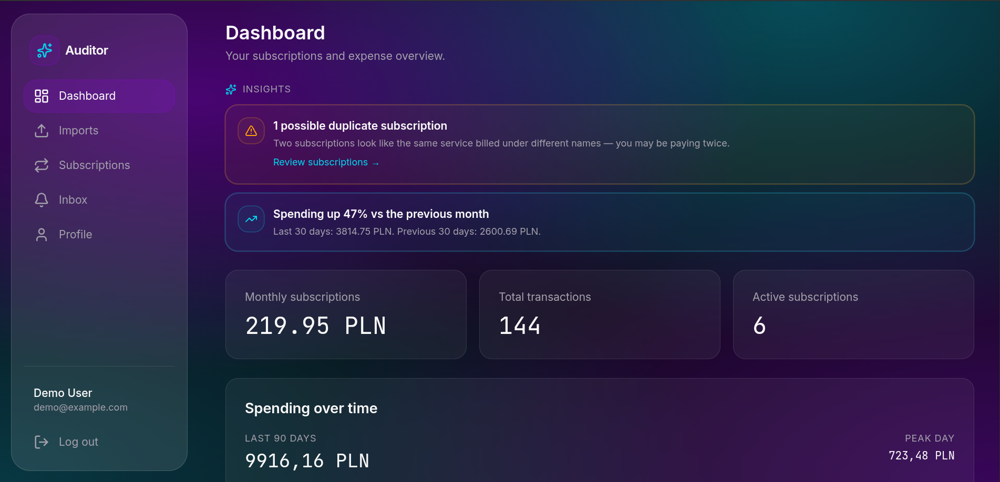
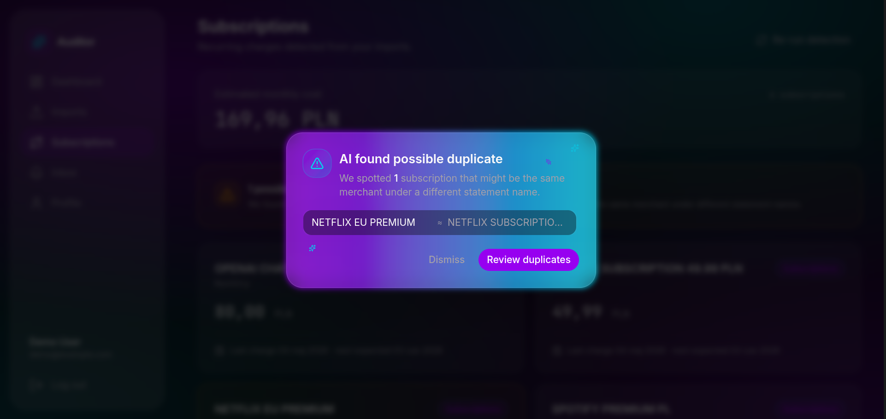
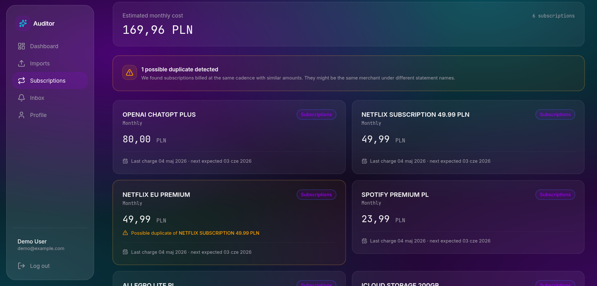
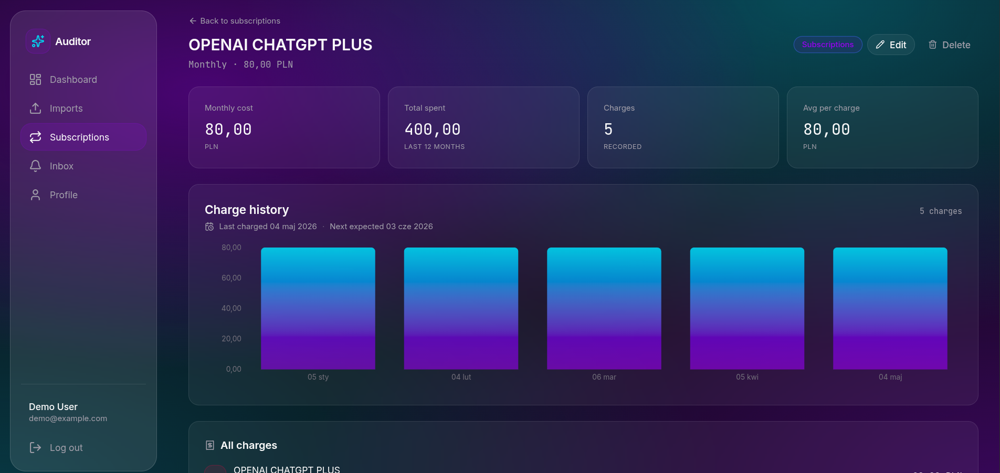
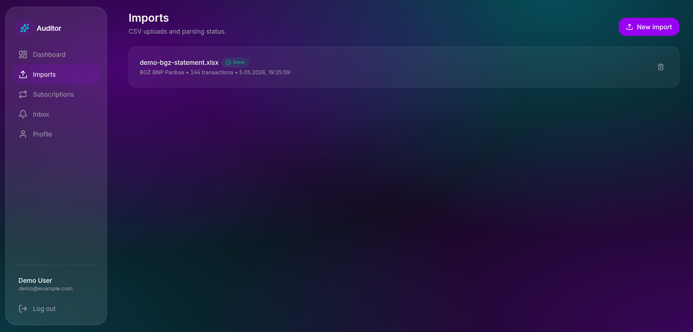

# Audytor Subskrypcji i Wydatków napędzany AI

Self-hostowana aplikacja do osobistych finansów: wczytuje wyciągi bankowe
(CSV/XLS) z polskich banków, automatycznie kategoryzuje transakcje przy pomocy
LLM i wykrywa powtarzające się subskrypcje — w tym prawdopodobne duplikaty,
za które możesz płacić dwa razy.

Zbudowane jako projekt portfolio — priorytet to czysta architektura,
testowalność i działający end-to-end flow.

## Demo



_Dashboard: 90-dniowy area chart, statystyki konta i AI insights z alertem duplikatów (1 znaleziony) oraz spike alert (wydatki +47% vs poprzedni okres)._



_AI Duplicate Alert: wykryty duplikat (NETFLIX EU PREMIUM ↔ NETFLIX SUBSCRIPTION) prezentowany w modalnym alercie z gradient ringiem i floating sparkles. Dismiss persystowany w localStorage żeby nie męczyć usera przy każdym wejściu._



_Lista subskrypcji: karty z monthly cost, cyklem rozliczeniowym i datą następnego obciążenia. Duplikat oznaczony bezpośrednio w karcie ("Possible duplicate of NETFLIX SUBSCRIPTION 49.99 PLN") — user może rozstrzygnąć ręcznie przez Mark as same / Keep separate._



_Strona detalu subskrypcji: bar chart historii obciążeń (Recharts z gradient fill), 4 karty statystyk (Monthly cost / Total spent / Charges / Avg per charge) oraz pełna lista transakcji powiązanych z merchantem._



_Importy: każdy upload CSV przechodzi przez async pipeline (`ProcessImportJob` → batched `CategorizeTransactionsJob` → `DetectSubscriptionsJob`). Status widoczny live; failed imports z opcją retry, soft-delete z 30-dniowym TTL._

---

## Funkcje

- **Import wyciągów z 5 banków** — parsery dla **mBank, PKO BP, ING, Santander, BGŻ BNP Paribas**.
  Bank rozpoznawany automatycznie po nagłówkach pliku; manualny dropdown jako
  fallback gdy detekcja zawiedzie.
- **Idempotentny import** — ponowne wgranie tego samego wyciągu nie tworzy
  duplikatów dzięki deterministycznemu hashowi
  `sha256(user_id|posted_at|amount|description|balance)`.
- **Kategoryzacja AI z kontrolą kosztów** — Groq (Llama 3.3 70B) lub DeepSeek
  (`deepseek-chat`) przez OpenAI-compatible HTTP, batch 20 transakcji na
  prompt, walidacja schematu JSON żeby zablokować halucynowane slugi. Redis
  cache kluczowany po znormalizowanym fingerprincie kupca z prompt-version
  invalidation, TTL 30 dni.
- **Rule-based wykrywanie subskrypcji** — grupuje wydatki po znormalizowanej
  nazwie kupca, awansuje grupę do `Subscription` gdy widać ≥2 obciążenia
  25–35 dni od siebie z spójną kwotą (±10%).
- **Wykrywanie duplikatów subskrypcji** — flaguje subskrypcje dzielące
  meaningful token, billing cycle i kwotę w obrębie ±15%
  (np. `NETFLIX.COM` vs `NETFLIX EU`) tak żeby headline monthly total nie
  liczył się dwa razy. User może rozstrzygnąć każdy duplikat ręcznie:
  **Mark as same** (potwierdza, detector zachowa flagę) lub **Keep separate**
  (czyści flagę i blokuje detektor przed jej ponownym ustawieniem).
- **Strona detalu subskrypcji** — bar chart z historią obciążeń, statystyki
  (koszt miesięczny / total spent / liczba obciążeń / średnia), lista
  wszystkich transakcji powiązanych z merchantem, link do oryginału jeśli
  detektor sflagował tę subskrypcję jako duplikat.
- **Modal AI Duplicate Alert** — Framer Motion entrance z animowanym gradient
  ringiem i floating sparkles, "Review duplicates" CTA scrolluje do
  flagowanych kart, dismiss persystowany w localStorage tak żeby modal
  pojawiał się ponownie tylko przy nowym zestawie duplikatów.
- **Dashboard analityczny** — area chart wydatków 90-dniowych, donut z
  breakdownem kategorii, widget top-5 subskrypcji, AI insights alert
  (duplikaty + skoki wydatków vs poprzedni okres).
- **Async pipeline** — każdy CSV parsowany w queue jobie, potem `Bus::batch`
  jobów kategoryzacji, na końcu `DetectSubscriptionsJob` uruchamia się gdy
  batch się zakończy.
- **Szyfrowanie PII at-rest** — `transactions.description` i `counterparty`
  używają Laravel `encrypted` cast (AES-256 przez `APP_KEY`).
- **Dostępność (a11y)** — focus-visible rings na wszystkich interaktywnych
  elementach, respektowanie `prefers-reduced-motion`, semantyczny HTML,
  kontrast WCAG AA, pełna nawigacja klawiaturowa.

## Stack

- **Backend:** Laravel 13, PHP 8.5, PostgreSQL 18, Redis 8
- **Frontend:** Inertia.js + React 18 + TypeScript, Tailwind CSS, Recharts, Framer Motion, Lucide
- **AI:** Groq (`llama-3.3-70b-versatile`) lub DeepSeek (`deepseek-chat`) — OpenAI-compatible chat completions
  z wymiennym `FakeAiCategorizer` do dev/CI bez kluczy
- **Infra:** Laravel Sail (php-fpm 8.5 / pgsql / redis / mailpit / queue worker), Docker Compose
- **Quality gates:** Pest (146 testów), Larastan level 8, Pint, TypeScript strict mode

## Quickstart

Wymagania: Docker, Docker Compose. Lokalny PHP/Node toolchain niepotrzebny do
uruchomienia.

```bash
git clone https://github.com/daniel-ciupek/AI_subscription_and_expense_auditor.git
cd AI_subscription_and_expense_auditor
cp .env.example .env

# Instalacja zależności PHP (raz, krótkotrwały kontener composer jeśli nie masz PHP lokalnie)
docker run --rm -u "$(id -u):$(id -g)" -v "$(pwd):/var/www/html" -w /var/www/html \
    composer:latest composer install --ignore-platform-reqs --no-scripts

# Start stacka
./vendor/bin/sail up -d

# APP_KEY, migracje, dane demo
./vendor/bin/sail artisan key:generate
./vendor/bin/sail artisan migrate
./vendor/bin/sail artisan db:seed --class=DemoSeeder

# Frontend dev (HMR)
./vendor/bin/sail npm install
./vendor/bin/sail npm run dev
```

Wejdź na <http://localhost> i zaloguj się:

- **Email:** `demo@example.com`
- **Hasło:** `demo1234`

Konto demo ma wstępnie załadowane ~140 realistycznych transakcji z 120 dni,
6 wykrytych subskrypcji (jedna celowo jako near-duplicate, żeby pokazać
ścieżkę alertu), skategoryzowanych przez deterministyczny `FakeAiCategorizer`.

## Przełączanie na realne AI

Domyślnie aplikacja chodzi na `AI_DRIVER=fake` więc działa bez płatnych
credentials. Wpięte są dwa produkcyjne drivery — oba mówią protokołem
OpenAI-compatible chat completions, więc shape requestów i walidacja są
identyczne.

**Groq (Llama 3.3 70B):**

1. Pobierz klucz z <https://console.groq.com>.
2. Ustaw w `.env`:
   ```env
   AI_DRIVER=groq
   GROQ_API_KEY=gsk_...
   ```

**DeepSeek (`deepseek-chat`):**

1. Pobierz klucz z <https://platform.deepseek.com/api_keys>.
2. Ustaw w `.env`:
   ```env
   AI_DRIVER=deepseek
   DEEPSEEK_API_KEY=sk-...
   ```

Po każdej zmianie zrestartuj queue worker żeby binding podchwycił:
`./vendor/bin/sail restart queue`. Wcześniej zacache'owane kategoryzacje
pozostają ważne, bo każdy driver niesie własną prompt version w cache key —
providerzy nie zatruwają sobie nawzajem cache.

## Struktura projektu

```
app/
├── Actions/                 — akcje biznesowe (single responsibility)
│   ├── ImportCsvAction.php
│   └── DetectSubscriptionsAction.php   # rule-based + flagowanie duplikatów
├── Contracts/               — interfejsy dla wzorca Strategii
│   ├── AiCategorizerInterface.php
│   └── CsvParserInterface.php
├── Http/Controllers/        — cienkie: walidacja, autoryzacja, delegacja, render
├── Jobs/                    — async pipeline
│   ├── ProcessImportJob.php
│   ├── CategorizeTransactionsJob.php   # batchowane + Redis cache
│   └── DetectSubscriptionsJob.php      # po zakończeniu categorize batcha
├── Policies/                — autoryzacja per-resource (ImportPolicy, SubscriptionPolicy)
├── Services/
│   ├── AiCategorizers/      — FakeAiCategorizer, GroqAiCategorizer, DeepseekAiCategorizer
│   ├── Parsers/             — 5 parserów banków + StatementReader (CSV/XLS/ODS)
│   └── BankDetector.php     # auto-detect po nagłówkach
└── Support/
    ├── TransactionNormalizer.php       # fingerprinting kupca
    └── SubscriptionMonthlyCost.php

resources/js/
├── Components/Dashboard/    — Recharts widgety (donut, area, top subs, alerts)
├── Components/Subscriptions/ — DuplicateAlertModal (AI alert z Framer Motion)
├── Components/UI/           — Button, Card, Modal, EmptyState, Toast, FormField, ...
├── Pages/                   — strony Inertia (Dashboard, Imports, Subscriptions/Index + Show, ...)
└── Layouts/

database/
├── migrations/              — schemat (users, imports, transactions, categories, subscriptions, ai_categorizations)
└── seeders/
    ├── CategorySeeder.php
    └── DemoSeeder.php       # idempotentny dataset demo
```

## Highlighty architektoniczne

### Wzorzec Strategii × 2

- **`AiCategorizerInterface`** ma trzy implementacje: `FakeAiCategorizer`
  (deterministyczne keyword matching, używane w testach + `AI_DRIVER=fake`),
  `GroqAiCategorizer` (HTTP klient Groq) i `DeepseekAiCategorizer` (HTTP
  klient DeepSeek). Oba produkcyjne drivery retryują z exponential backoff,
  walidują JSON odpowiedź względem strict schema i fallbackują do `other`
  zamiast pozwolić halucynowanym slugom dotrzeć do bazy.
- **`CsvParserInterface`** ma jedną implementację per bank. `BankDetector`
  matchuje header row pliku do sygnatury każdego parsera; przy remisie/braku
  matcha dropdown banku w form imports służy jako fallback.

### Async pipeline

```
ProcessImportJob (parse + persist) ─┐
                                    │
  Bus::batch([                      │   każdy chunk = do 20 transaction ID
    CategorizeTransactionsJob,      ◄── per-tx Redis cache (sha256 znormalizowanego
    CategorizeTransactionsJob,      │   description + sign kwoty), TTL 30 dni,
    ...                             │   automatycznie unieważniany przy zmianie
  ])->then(DetectSubscriptionsJob)  │   prompt version
```

### Idempotencja na każdej granicy

- **Imports:** `firstOrCreate` keyed na `(user_id, hash)` — re-upload tego
  samego wyciągu wstawia zero nowych wierszy. Pipeline post-importowy
  uruchamia się tylko jeśli faktycznie wstawiono ≥1 wiersz.
- **Detekcja:** `updateOrCreate` keyed na `(user_id, name, billing_cycle_days)`.
  Ponowne uruchomienie detektora nigdy nie duplikuje subskrypcji.
- **DemoSeeder:** wycina dane demo usera przed seedowaniem, więc re-run jest
  bezpieczny.

### Kontrola kosztów AI

- **Cache** — normalizuj description (lowercase, usuń cyfry/interpunkcję,
  zwiń whitespace), hashuj razem ze znakiem kwoty. Powtarzalni kupcy hitują
  cache po pierwszym wystąpieniu.
- **Batching** — 20 transakcji per prompt zmniejsza koszt API ~20×.
- **Wersjonowanie** — `ai_prompt_version` zapisany na zacache'owanej wartości
  ORAZ na audit row. Bump promptu unieważnia stare cache entries bez
  flushowania Redisa.
- **Walidacja schematu** — Laravel `Validator` z allow-listą `in:` na slugach
  w odpowiedzi LLM. Schema violation → fallback do `other`, nigdy nie
  pozwoli wymyślonym kategoriom dotrzeć do dashboardu.

### Dostępność (a11y)

- **Focus rings** — każdy interaktywny element ma
  `focus-visible:ring-2 ring-accent-neon` (lub `ring-state-danger` przy
  destrukcyjnych akcjach). Bez `focus:` (myszka), tylko `focus-visible:`
  (klawiatura).
- **`prefers-reduced-motion`** — wszystkie animacje Framer Motion czytają
  `useReducedMotion()` i pomijają entrance/exit gdy user preferuje
  zredukowany ruch. Dekoracyjne animacje CSS (mesh shift, sparkles, gradient
  pulse) opakowane w `motion-safe:` prefix.
- **Semantyka** — `<button>` zamiast `<div onClick>`, `<nav>`/`<main>`,
  `aria-label` na ikonowych przyciskach, `role="dialog"` + `aria-modal` na
  modalach, `aria-live="polite"` na toastach.
- **Kontrast WCAG AA** — text-primary `#FAFAFA` na bg-base `#0A0A0F` daje
  >15:1; secondary `#A1A1AA` daje >7:1.

## Testowanie

```bash
./vendor/bin/pest                  # 146 testów (feature + unit)
./vendor/bin/phpstan analyse       # Larastan level 8
./vendor/bin/pint --test           # Style check
npm run typecheck                  # TypeScript strict
```

Pest chodzi lokalnie na in-memory SQLite (~5s) i na PostgreSQL w Sailu dla
parity z produkcją.

## Wspierane banki

| Bank             | Sygnatura nagłówków                                 | Testowane na realnych danych |
|------------------|-----------------------------------------------------|------------------------------|
| mBank            | `#data operacji`                                    | Syntetyczne fixture'y |
| PKO BP           | `typ transakcji + opis transakcji`                  | Syntetyczne fixture'y |
| ING              | `dane kontrahenta`                                  | Syntetyczne fixture'y |
| Santander        | `opis nadawcy/odbiorcy`                             | Syntetyczne fixture'y |
| BGŻ BNP Paribas  | `data zaksięgowania + numer rachunku kontrahenta`   | ✅ Konto autora |

Dodanie szóstego banku = jedna implementacja `CsvParserInterface` + sygnatura
nagłówków + test napędzany fixture'em. Żadne inne zmiany niepotrzebne.

## Licencja

MIT — patrz `LICENSE`.

## Autor

Zbudowane przez [Daniela Ciupka](https://github.com/daniel-ciupek).
